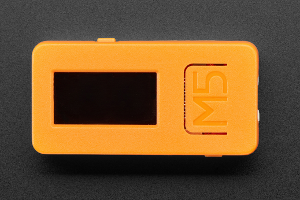
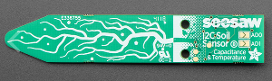

With a microcontroller, a few lines of python, and a capacitive soil moisture sensor, we can create a tool to help us remember to water our plant. Not only will we create an IoT (internet of things) device, but we'll also learn some things about computer science and the internet along the way.

## What you'll need

### [M5Stick C](https://m5stack.com/collections/m5-core/products/stick-c)

The M5Stick C is a little computer. Built around an [esp32](http://esp32.net/), the M5Stick C has a 2 core processor that can run up to 240MHz. With this we can get input values from sensors and other devices, and create outputs as well. It has a little 80x160 pixel screen, LED, battery, gyroscope and a microphone all in one tiny package. Even better, it has the ability to connect to a wifi network and communicate with other computers on the internet.

This will be the "thing" in our "internet of things" device. We will use this little computer to communicate with the soil sensor, connect to a wifi network, and then send the data to a server. We'll also use the screen to create a nice visual that shows us the information in real time.

### [Adafruit STEMMA Soil Sensor](https://www.adafruit.com/product/4026)

The STEMMA Soil Sensor is a capacitive moisture sensor. It uses capacitance to measure the amount of moisture in the soil, which is different from the resistive measurement of other probes. This sensor will be more durable and more accurate over time, but we'll need to talk about how to use it. It's a sensitive device, pun intended.

## Tutorials

### 1. [Getting Started with M5Stick C](tutorials/Getting-Started-M5Stick)

- What's what on the M5Stick
- What we need to install to program it
- Making our first program

### 2. [Blink and Fade the LED](tutorials/Blink)

Control the LED with loops and the GPIO (General Purpose Input/Output) of the esp32

### 3. [Use to the Screen](tutorials/Display)

Work through using the various python modules to draw things on the screen. This is how we will make our animation

### 4. Working with Micropython

### 5. Connecting the Soil Sensor

### 6. Making REST API calls to Adafruit IO
