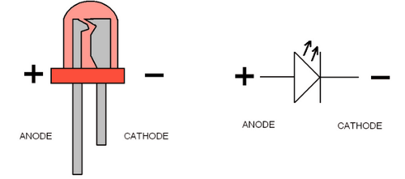
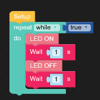
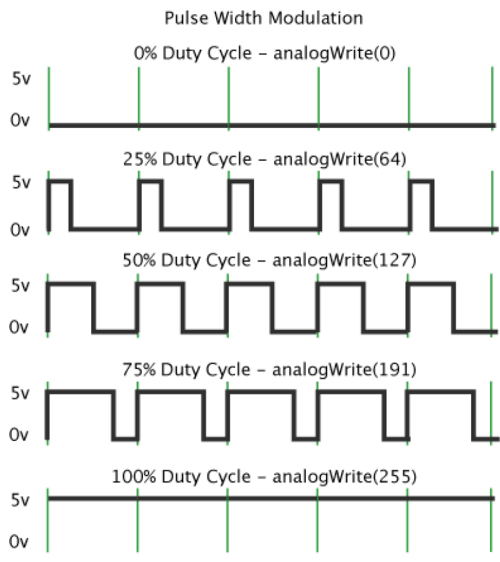
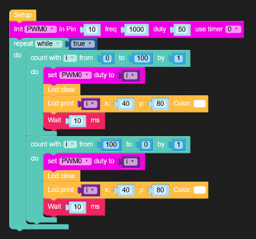
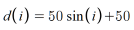
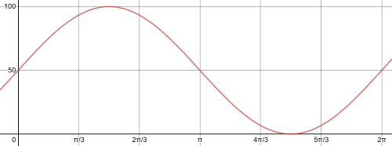
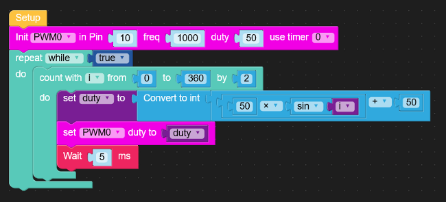

As an easy way to get started coding in UIFlow, we'll start by blinking and fading an LED.

## Topics we'll cover

1. Using the LED
2. Fading the LED: PWM (Pulse Width Modulation) - Sawtooth & Sinusoidal
3. Programming with UI Flow

## Using the LED

LED stands for Light Emitting Diode. The LED is a diode, which means it only allows electricity to flow in one direction. When electricity flows in the correct direction, it emits light.

Luckily, the M5Stack C has an LED built in. The LED's anode (positive end) is connected to **Pin 10** of the microcontroller, and the cathode (negative end) is connected to ground.

We'll start with a simple script that will turn the LED on and off in a loop:

This script includes a loop that will run as long as `True` is the same as `True`. That means it will run forever! This is a useful trick that we will rely on often to make sure a loop will run forever.

Second, it turns the LED on, waits a second, turns the LED off, waits a second, and loops infinitely. Play around with the wait time to see how fast you can make it blink. What happens if you use a block for `wait [ ] ms`

## Fading the LED

Right now the LED is going from fully on to fully off every cycle. To get a more interesting effect, we should fade the LED from off to on and back again. To do this, we'll use a feature called Pulse Width Modulation, PWM for short.

> Have you ever noticed that some LED light bulbs have a noticeable flicker? If you don't know what I'm talking about, find an LED light bulb and wave your hand in between you and the light. You should see a [stroboscopic effect](https://en.wikipedia.org/wiki/Stroboscopic_effect_(lighting)). The LED bulb isn't fully on, instead it's strobing at a given frequency to reduce strain on the bulb and sometimes reduce energy.

We will do something similar with our LED. We can have it blink at a **frequency** of 1000hz, or 1000 cycles of off/on per second. Each time it turns on during those 1000 cycles, we can also tell it how long to turn on for. This duration is called the **duty cycle**. The frequency usually stays fixed, but we can change the duty cycle very quickly, giving us the ability to fade the LED on and off in a smooth way.

*various PWM duty cycles*

We'll create two different fading effects, both using PWM:

### Fade #1 : Sawtooth Fade

for this, we'll use two loops back to back. Here's how the program will work:

> 1. Start the Duty Cycle at 0 and increase it to 100. This will fade the LED from *fully on* to *fully off*
> 2. Reverse it: start the Duty Cycle at 100 and decrease to 0. This will fade the LED from *fully off* to *fully on*
> 3. Each time take a break of 10 milliseconds
> 4. I also threw in a feature to print the current duty cycle to the LCD screen to make it easier to see how the duty cycle matches the LED brightness.

*the sawtooth program*

### Fade #2 : Sinusoidal Fade

The sawtooth wave is nice, but it could have a more gradual flow. This is where we could use trigonometric functions. We'll create a value of sine, and use that value to control the duty cycle of the LED.

We'll create the following sinusoidal function using a loop. Depending on your trig abilities, this is either much easier or much harder. It's certainly less code.

> 1. Using one loop, we'll go through one full cycle of a sine function from `0` degrees to `360` degrees.
> 2. For each iteration of the loop, we'll set the duty cycle to the output of the function above
> 3. Wait for 5 milliseconds

