## Tiny Display

In this tutorial, we'll focus on:

1. Displaying text to the LCD screen
2. Displaying graphics
3. Creating functions so we can keep our code easy to read

## Displaying text on the screen:

We'll use UIFlow for this tutorial. Its block interface makes it easy for people to get familiar with programming, but you are able to switch over to python if/when you're ready.

For start, we'll use the blocks in the Graphic bucket:
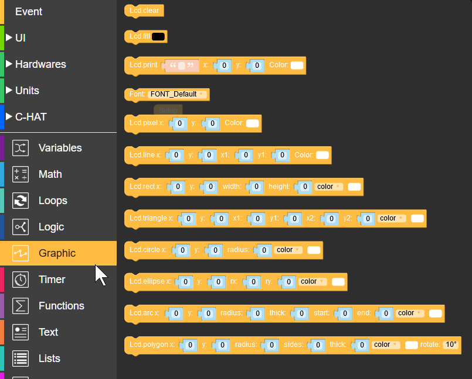

Here, we can use a number of functions to control the screen. all of these functions come from the Lcd module (a "library" of functions already written). With these functions you can draw primitive shapes (rectangles, triangles, circles...) and text. We will use these functions for the animation our stick will show when displaying the moisture level of our plant.

First, we'll draw some text on the screen. Here's what we'll create using the Graphic blocks in UIFlow:

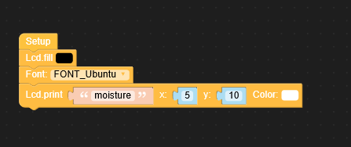

### Here's what those four blocks are doing:
1. Fill the screen with black. This effectively clears the sreen
2. Sets the font to `Ubuntu`. Not that big of a deal, but it's better than comic sans
3. Prints the text *"moisture"* to the screen. This places the *top left* corner of the text at the coordinate `(5, 10)`. As a note, the screen's top-left corner is the origin `(0,0)`, and the bottom right is the coordinate `(80,160)`.

That's the basics of text! You can change the font size by selecting a different font, but Ubuntu's size is a good size for this small screen.

Add some more lines of text to fill out the display:

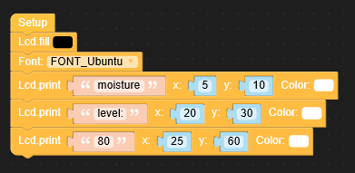

Notice how the x and y coordinates are changing. Since each string of text is a different width, the x coordinate needs to change to make it centered. If we were coding this in python, we could have used `lcd.center` to place it in the middle of the screen.

## Draw the Arc

To draw an arc on the screen, use the `arc()` function.

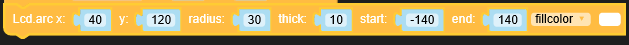

This function accepts as many as 8 parameters! That's a lot, but each is important:

> - `x` : x coordinate of the center of the circle that creates the arc
> - `y` : y coordinate of the center of the circle that creates the arc
> - `radius` : the radius of the circle that creates the arc
> - `thick` : how wide the arc should be
> - `start` : the angle where the arc starts being drawn (straight up is `0`)
> - `end` : the angle where the arc stops being drawn
> - `fillcolor` / `color` : the color of the inside / outside of the arc

For right now, we'll create a static arc:

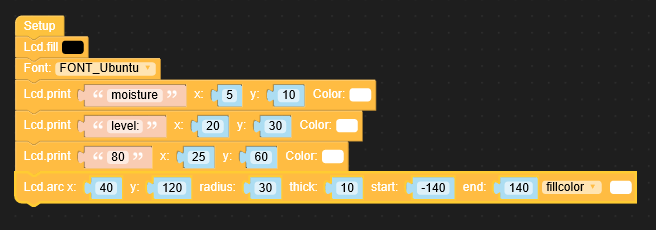

### "Animate" the arc

To create an nice visual, having the arc "grow" to the level, use a for loop! A for loop, or in UIFlow a "count with" loop, is a way to loop a portion of code a specified number of times.

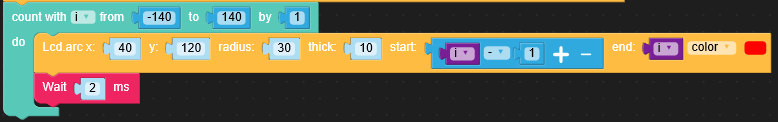

The for loop does a few things:
- Creates a variable (in this case it's `i`) that goes from `-140` to `140`, increasing by `1` each time the loop runs.
- Using the variable `i`, the arc's start goes from `-140` to `140`.
- In this example, only a small portion of the arc is drawn each time until the arc is totally "full"

## Creating a Function

Now that we have this great ability to draw the arc, we want to use it to display the reading we receive from our sensor. To do this, we really want to just give it a value (eg `600` of `1000`), show the value in text, and show it on our "gauge".

In the end, we want to create a function, just like in algebra, which accepts on parameter and displays the information:

`displayLevel(400) --> runs the code with 400 as the input`

In UIFlow, use the block for a function with no output:

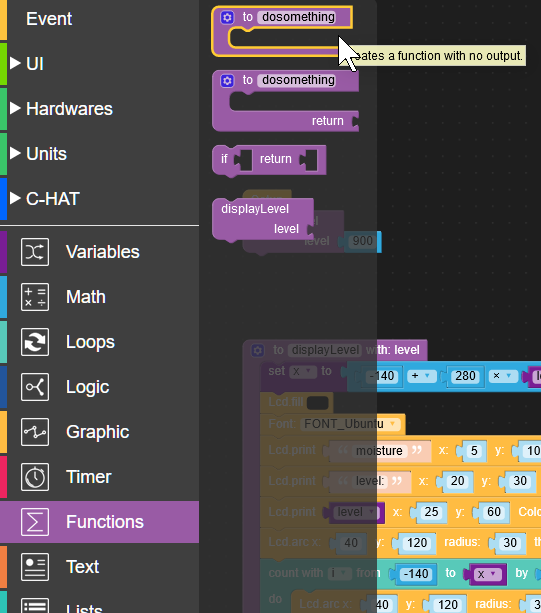

Notice that this block doesn't allow other blocks to "connect" above. A function is a separate, encapsulated, section of code that doesn't necessarily require something to precede it.

Once you place the function block in the program do the following:
- change the function's name to `displayLevel`.
- add an input by clicking on the gear icon  and dragging an `input name` block into the `inputs`.
- change the input variable to `level`

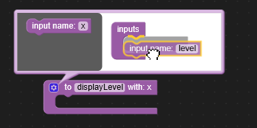

Now that we have a function named `displayLevel` that accepts an input named `level`, we'll need to create a variable that represents how far the arc needs to be drawn.

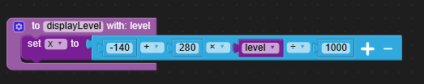

After this block, drag the rest of the animation code you had from before, but set the for loop to end at `x`, the variable you created in the last step. When it's all done, your code should look like this:

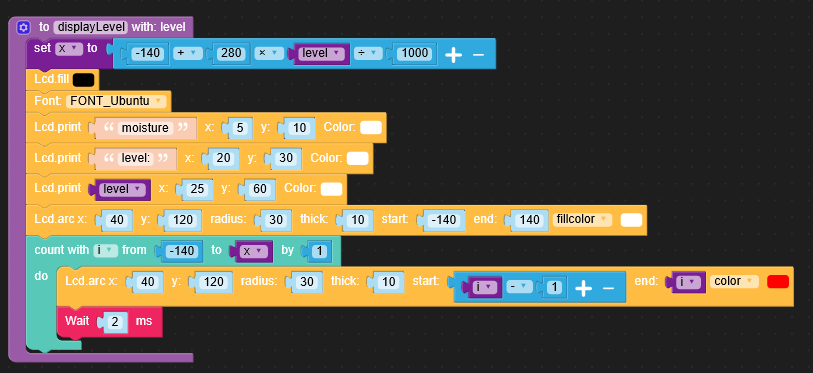

Finally, directly after setup, add a call to your new function providing a bogus input of `900`.

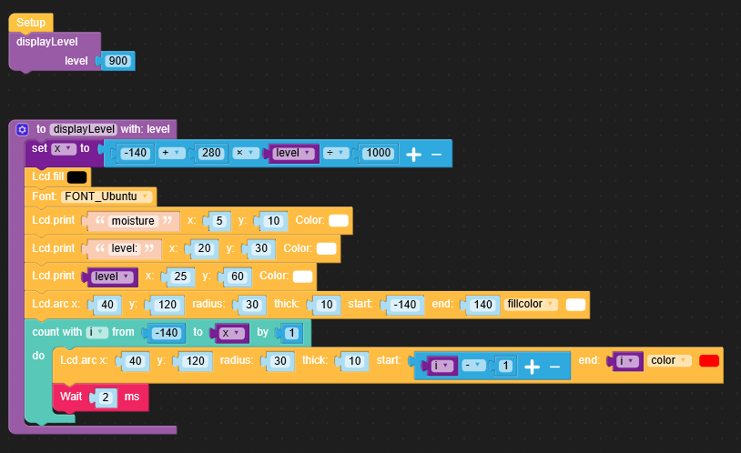

If you're having struggles after all of this, or if you want to skip this tutorial entirely, you can download the program and load it directly through the UIFlow interface.