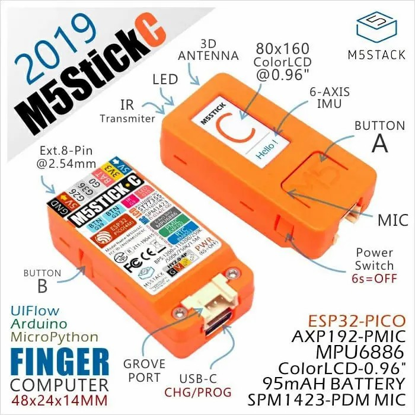

The M5Stick C has a number of features built in to a small package. This is helpful from the perspective of developing things based around it, but it can be complicated at first.

## Features of the M5Stick C

### 1. Turning it on/off/reseting

To turn the M5Stick C on, you push the button on the bottom left when the screen is facing you.

- If the M5Stick C is **off**, a quick click of the power switch will turn it on.
- If the M5stick C is **running**, a quick click of the power switch will perform a *soft reset*
- If the M5Stick C is **running**, pressing the power switch for 6 seconds will turn it off

### 2. Buttons A and B

The other two buttons are called button A and button B. Button A is on the front, button B is on the upper right. These two buttons are treated as general inputs and we can program them to trigger various things.

### 3. USB C

The M5Stick C accepts a USB-C cable to charge and program. This is nice for people who have moved away from USB-Micro or Lightning Cables, but it might be hard for some of you who haven't yet done that. Luckily, they included a very small USB-C cable in the kit that you can use to program and charge the device. When it comes time to use it as a real plant monitor, we'll need to get something longer.

### 4. Battery

The battery is tiny, which shouldn't surprise you. At 95mAH, it's 3-4% of the battery capacity your phone has. That said, with the appropriate battery management, we can get roughly a day of life for what we need, and many people have gotten days from esp32 based microcontrollers.

### 5. Grove Port

This Grove port is where we can easily plug in sensors. The grove cable is a proprietary cable, made by a company called Seeed Studio in China. Luckily, another non-proprietary cable will work too, you just have to modify it a bit. We'll discuss that more later when we get to using the soil sensor.

### 6. LCD Screen

The LCD screen isn't incredible, but it's great for such a small/cheap package. The LCD screen is 80 pixels wide by 160 pixels tall. Luckily, M5Stack has created many modules and libraries of code to help us program the display easily.

### 7. Multiple programming languages

Since the M5Stick C is based on an esp32, it can be programmed in many different ways. Java, Python, C++ and more. We'll use Micropython for our work since it's easy to learn and to understand for beginners.

## First run

First, check out [M5Stack's quick start](https://docs.m5stack.com/#/en/quick_start/m5stickc/m5stickc_quick_start_with_uiflow). We'll be using UIFlow, which is their way of programming their board based on micropython. They have a well documented process for installing UIFlow onto the M5Stick for both Windows and Mac. When you select the version choose `1.4.5.1`. When you are installing, you will also be able to give the M5Stick your wifi's name and password. This is important, since we will be able to upload code through their web-based programming environment if we need to.
